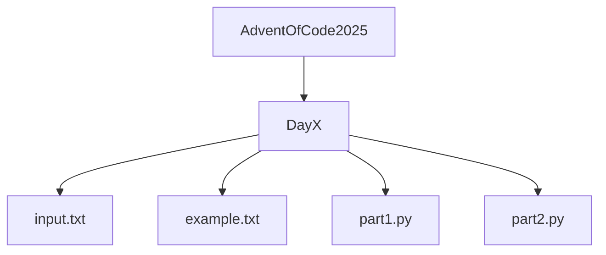

# Advent of Code 2025 — Python Solutions 🚀


Solve every puzzle of **Advent of Code 2025** using **Python 3**, with clean, modular, and well-documented code.  

[](https://www.python.org/)  
[](LICENSE)  
[](https://github.com/A-Cdnt/AdventOfCode_2025/stargazers)  
[](https://github.com/A-Cndt/AdventOfCode_2025/network/members)
[](https://github.com/A-Cndt/AdventOfCode_2025/actions)


 
 
 
 
 
 
 
 
 
 

---

## 🔹 About

**Advent of Code** is an annual programming challenge released in December with daily puzzles.  
Each day contains **2 parts**, often requiring creative logic, data structures, or algorithms.  

This repository contains:

- My **Python 3** solutions for each day.
- Structured folders for each day (`DayX`) with `input.txt` and `example.txt`.
- Readable, documented scripts using **docstrings** and type annotations.
- Modular code for reusability across puzzles.

---

## 🔹 Repository Structure



---

## 🔹 Features

- ✅ Automatic input reading (`input.txt` or `example.txt`)
- ✅ Clear computation for part 1 & part 2
- ✅ Styled console output with color and formatting
- ✅ Well-structured, maintainable, and annotated Python code
- ✅ GitHub Actions CI ready
- 🎯 Track progress with badges and visual summaries

---

## 🔹 Tech Stack

- **Python 3.11+**
- Standard library only — no external dependencies
- Cross-platform (Windows, Linux, macOS)

---

## 🔹 Usage

```bash
python Day1/part1.py
python Day1/part2.py
```

Console output shows the password or the final result in a clean, readable format.

##🔹 Badges & Fun

Track progress with GitHub stars, forks, and contributions.

## 🔹 Goal

- Document my solutions and logic for Advent of Code 2025.
- Improve algorithmic thinking and Python skills.
- Maintain a personal archive of well-commented solutions.

| Day | Part 1 | Part 2 | Status |
| --- | ------ | ------ | ------ |
| 1   | ✅      | ✅      |  |
| 2   | ❌      | ❌      |  |
| 3   | ❌      | ❌      |  |
| 4   | ❌      | ❌      |  |
| 5   | ❌      | ❌      |  |
| 6   | ❌      | ❌      |  |
| 7   | ❌      | ❌      |  |
| 8   | ❌      | ❌      |  |
| 9   | ❌      | ❌      |  |
| 10   | ❌      | ❌      |  |
| 11  | ❌      | ❌      |  |
| 12  | ❌      | ❌      |  |


